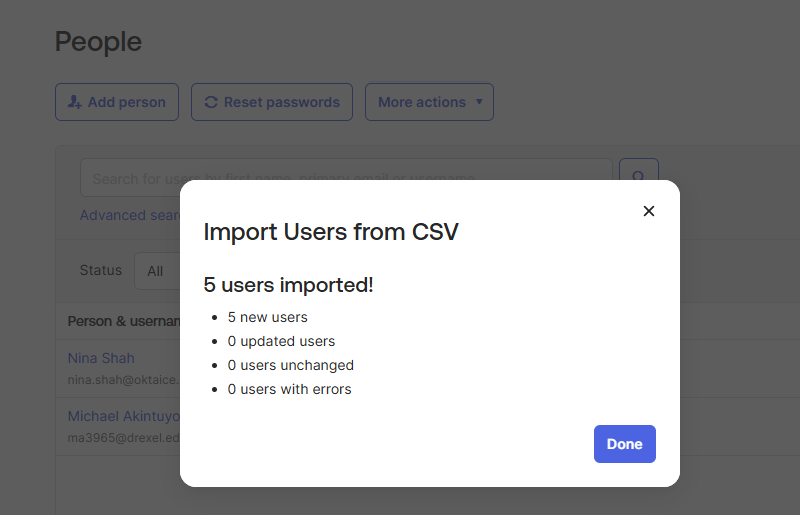
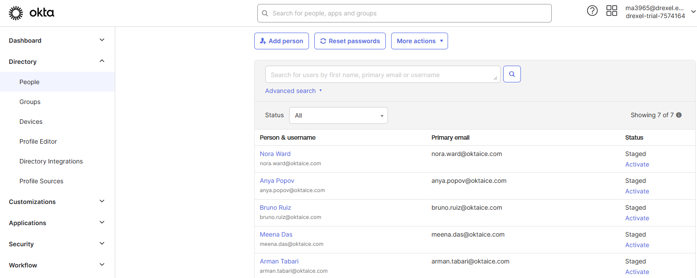
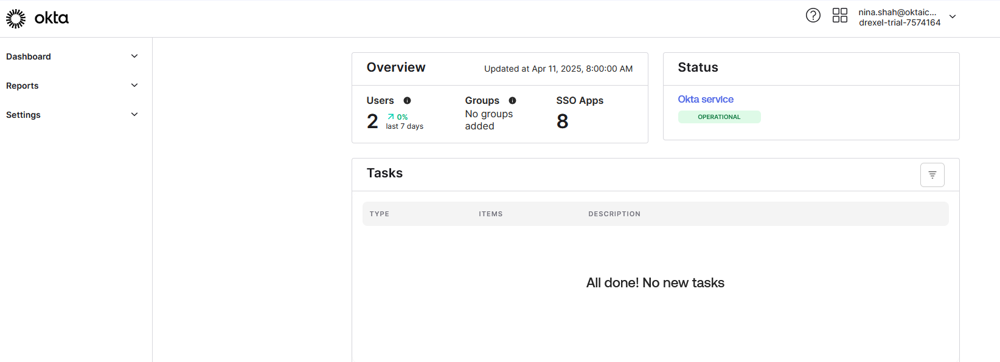
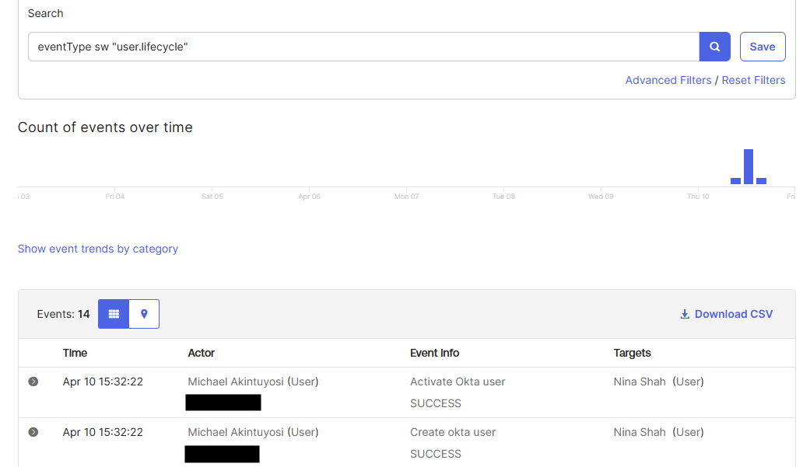
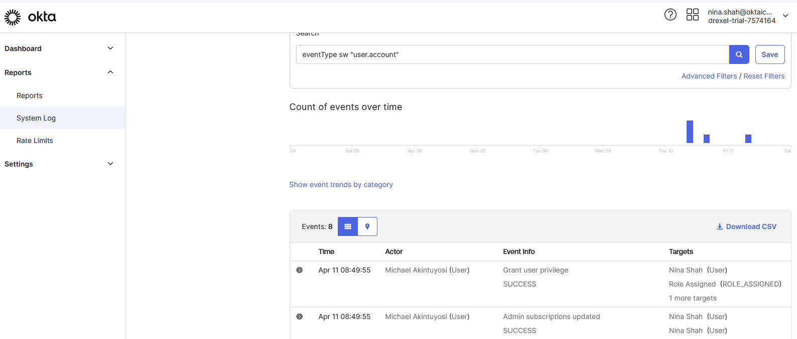

# 🛡️ Okta User Management Lab

This lab showcases how to create and manage users in Okta through manual entry and CSV import, and how to assign standard administrative roles. It demonstrates core identity and access management tasks.

---

## 🧩 Lab Objectives

- ✅ Create a user manually in Okta
- ✅ Import users via CSV file
- ✅ Assign an admin role
- ✅ Verify actions using system logs

---

## 🚀 Lab Breakdown

### 🔹 Lab 1: Create a User in Okta

**Scenario**: Nina Shah needs access.

**Steps**:
1. Go to `Directory > People` → click **Add Person**
2. Fill in the following:
   - First name: 
   - Last name:
   - Username:
   - Email:
   - Password:
3. Activate user from the email.
4. Set up **Okta Verify**.

**✅ Verification**:  
Nina's status becomes **Active**.

📸 Screenshot:  

---

### 🔹 Lab 2: Import Users via CSV

**Steps**:
1. Go to `Directory > People` → **More actions > Import from CSV**
2. Upload your `UserImport.csv`
3. Confirm users show as **Staged**

📸 Screenshot:  

---

### 🔹 Lab 3: Assign Admin Role

**Scenario**: Grant Nina the **Report Administrator** role.

**Steps**:
1. Go to `Security > Administrators`
2. Assign role:
   - Admin: `Nina Shah`
   - Role: `Report Administrator`
3. Log in as Nina in incognito to verify limited access

**✅ Nina should see**:
- Dashboard
- Reports
- Settings

📸 Screenshot:  

---

## 📊 System Log Verification

Check `Reports > System Log` for these events:

- `Create Okta user` – SUCCESS
- `Activate Okta user` – SUCCESS
- `Grant user privilege` – SUCCESS

📸 Screenshot:  

---

## 🧰 Tools Used

- Okta Admin Console
- Okta Verify
- CSV File Upload

---

## 🧠 Key Takeaways

- Okta makes user onboarding and role management straightforward.
- Admin roles provide least privilege access.
- System logs are essential for verifying identity actions.

---

## 📎 Resources

- [Okta Docs](https://developer.okta.com/docs/)
- [Okta Admin Console](https://www.okta.com/)

---

> 💡 **Author:** Michael Akintuyosi  
> 🎓 Student @ Drexel University  
> 🔐 Aspiring Security Analyst/IAM Analyst
